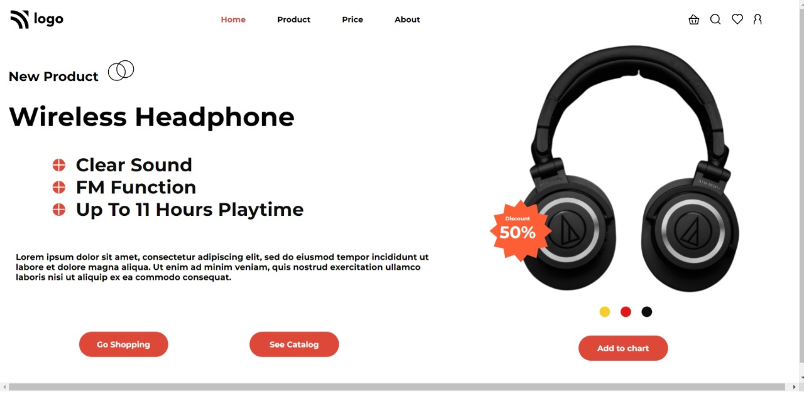

# Project-07-  Product Home Page
 ##  Hey there ,  I am Amarjeet 
 I have built a template of HTML and CSS project using my core css skills 
 
 
 
 

 My Live Deployed Website Link:- [Click here !](https://project-07-product-home-page.netlify.app/)

 
 

 ## For making this project I spend almost 4 hours.

 ## What I learned from this project 
 - First of all I explore more about image adjustment on the web page.
 - How change color of any icon like + in my page.
 - Also I explore about box-shadow and how to aply box-shadow to all side of a box.
